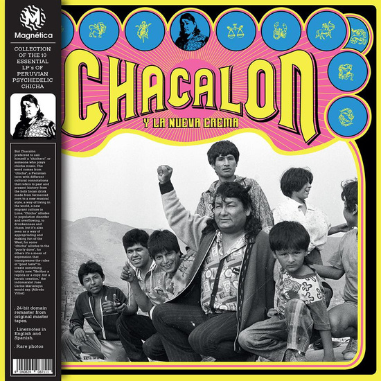
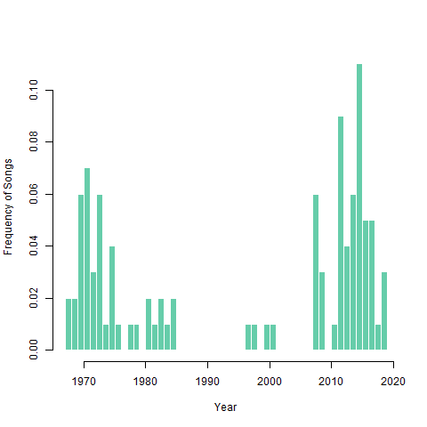
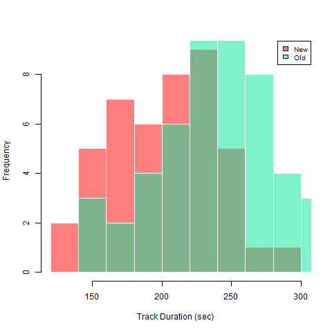
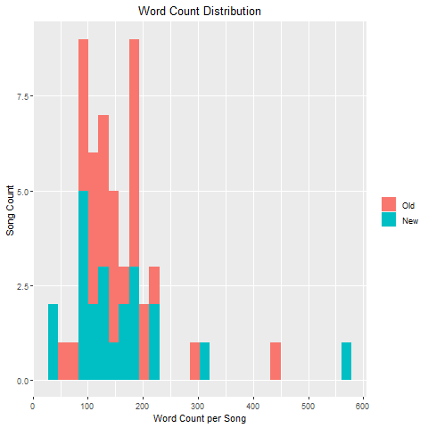
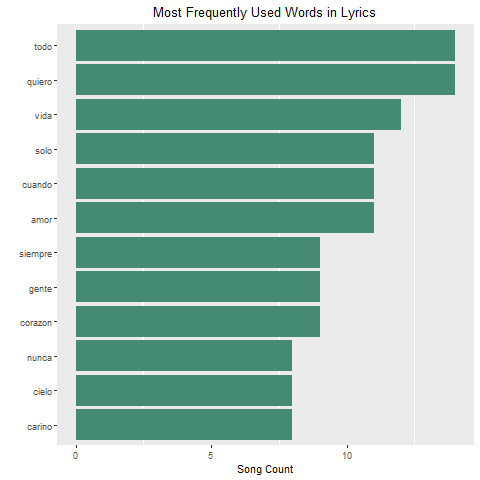
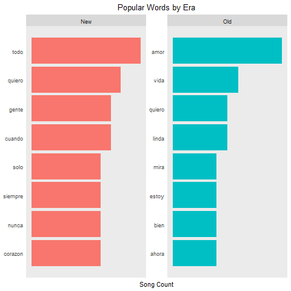
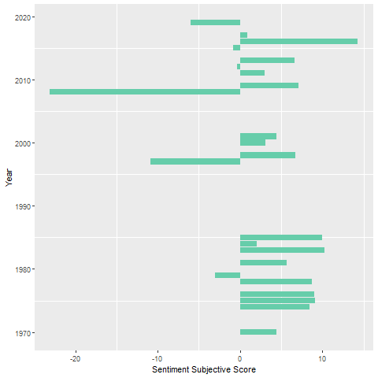

# Text_Analysis_Chicha
By Fabiola M. Alba Vivar

I created a code in R that uses text and sentimental analysis to analyse one of my favorite playlists: Peruvian Psychedelic Chicha

Recommended: Listen to the playlist while reading this: spotify:playlist:5owR7sSGZ0cCE8E5gsNW8x

## Data Input
I created a dataset of song's lyrics based on my -kinda famous- Spotify playlist. A little bit of context: peruvian cumbia and chicha were super popular around the 70s in Lima as a product of the huge rural-urban migration. It came back to life in the 2010s, becoming popular among young generations (like me!).

I compiled the biggest hits in this playlist/dataset. 

Check these videos to get to know more about this music genre and its history.
https://youtu.be/WKZKz11hIek
https://youtu.be/6mZ3EY6-r2U

## Some Fun Facts 

I selected modern and classics for this playlist, as you can see in the histogram, there is a gap from mid 80s to 2010s. 
Not surprisingly, this is also one of the worst times in Peru's history: economic and social crisis and after recovery. 
Seems like prosperity brings out this music... 

I also check and plotted how long are these songs. New modern songs (after 2000) are 45 seconds longer compare with the old ones in average. 

## Text and Sentimental Analysis
I compiled lyrics from all the songs on my playlist. Why? Well, I have always been interested on how music represents the current feelings on the economy (from real people - no inflation time series!). Social phenomena are sometimes quite hard to quantify, most of the research done on the peruvian chicha culture (rural migrants arriving to Lima) are mostly based on socio/antropology studies, which rely mostly on interviews. However, what can we see on numbers about how people face these times? A nice simple approach is to use text and sentimental analysis.  

I'm going to make this analysis comparing the classics (the 70's era) versus the modern renaissance (the 2010s era). 
Old song seems to have song with the most number of words compared to the new ones. This might be because a lot of them are covers and they only used extracts of old songs.

Overall, the most common words used in the songs are "everything, want, life, alone, when, love, always, people, heart, never, sky, sweetheart". I took several hours constanly listening to these songs and I'm not surprised by these results. The overall feeling transmited into this lyrics reflected the migrant sentiment: hope and love. Most the songs are stories about leaving your hometown, missing your lover, hoping for a better future and adapting to the city culture. 

When breaking down the results from old and new songs, the new ones are very positive. "love, life, pretty, fine, now, etc".
Again, this is not surprising given the context is different but also, the audience is different: new generations already established in the city, enjoying (the not so fair or sustainable) economic prosperity.

Finally, I wanted to quantify one dimension of the sentiment reflected on these lyrics. I know this is something complex to process and so subjective, of course! A song might make you feel different than it would make me feel. But simplyfying this to one dimension, it might make it easier. For example, is this word making you feel good or bad? Let's say "sunshine", it's more on the positive side than negative. 

Overall, all my index using sentimental analysis in Spanish gave me very neutral results. Probably because some words and phrases are hard to categorize. So I created a new data base where I included a score for each word, in a range from [-1,1]. I found that modern songs are more "positive" than the old ones, probably reflecting less strugles that people did in the past. Of course, this is completly subjective, you can create your own weights as well, and run your own sentiment analysis. 

You can find all the data sets, graphs and R code in this site.
Use it to create your own version and have some fun. 
I hope this inspire you to use data to explore other social phenomena.
If you find any error or have any interesting suggestion, please contact me. 

